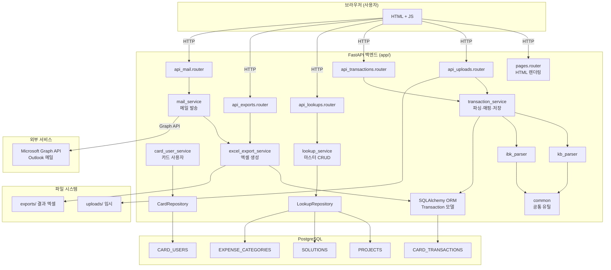

# 00. 프로젝트 전체 개요 (Overview)

## 1. 문서 목적
이 문서는 **Card Auto** 프로젝트 전체를 한눈에 파악하기 위한 개요 문서입니다.  
처음 접하는 사람도 이 문서 하나로 프로젝트의 목적, 구조, 동작 방식을 이해할 수 있도록 작성되었습니다.

---

## 2. 핵심 요약

| 항목 | 내용 |
|------|------|
| **프로젝트명** | Card Auto |
| **한 줄 설명** | KB/IBK 법인카드 승인내역 엑셀을 자동 파싱·매핑하여 담당자별 결과 파일을 생성하고 Outlook으로 자동 발송하는 사내 관리 도구 |
| **기술 스택** | FastAPI (Python), PostgreSQL, Jinja2 템플릿, Tailwind CSS, openpyxl, MSAL(Microsoft Graph API) |
| **주요 사용자** | 경영지원 담당자 (법인카드 관리 업무 담당) |
| **실행 방식** | 로컬 웹 서버 (uvicorn) → 브라우저 접속 |

---

## 3. 이 프로그램이 해결하는 업무 문제

**기존 방식의 문제:**
- KB/IBK 은행에서 법인카드 승인내역 엑셀을 다운로드
- 수작업으로 카드번호 → 사용자 매핑
- 각 카드 사용자별로 별도 엑셀 파일 수동 작성
- 이메일 수동 발송

**이 시스템이 해결하는 것:**
- 엑셀 파일 업로드 → **은행 자동 판별** (KB/IBK)
- **카드번호 기반 사용자 자동 매핑**
- 사용자별 **결과 엑셀 파일 자동 생성** (드롭다운 포함)
- Outlook으로 **자동 메일 발송** (Microsoft Graph API)

---

## 4. 주요 사용자 시나리오

### 시나리오 A: 월말 법인카드 내역 처리
1. KB/IBK에서 월별 승인내역 엑셀 다운로드
2. Card Auto에 업로드 → 은행 자동 판별, 사용자 매핑 자동 처리
3. 거래내역 화면에서 매핑 상태 확인
4. 결과 파일 생성 화면에서 개인별 엑셀 다운로드 또는 전체 ZIP 다운
5. Outlook 인증 후 전체 또는 개별 메일 자동 발송

### 시나리오 B: 신규 카드 사용자 등록
1. 카드 사용자 메뉴에서 신규 등록
2. 카드번호(전체 또는 끝4자리), 은행, 이메일 입력
3. 이후 업로드 시 자동 매핑에 반영

### 시나리오 C: 마스터 데이터 관리
- 프로젝트명, 솔루션명, 계정과목을 메뉴에서 관리
- 등록된 항목은 결과 엑셀의 드롭다운으로 자동 반영

---

## 5. 전체 구성 요약

```
┌──────────────────────────────────────────┐
│          브라우저 (사용자 화면)             │
│   Jinja2 템플릿 + Tailwind CSS + Vanilla JS│
└──────────────┬───────────────────────────┘
               │ HTTP (GET/POST/PUT/DELETE)
┌──────────────▼───────────────────────────┐
│           FastAPI 백엔드                   │
│  ┌─────────┐ ┌──────────┐ ┌───────────┐  │
│  │ Router  │→│ Service  │→│Repository │  │
│  └─────────┘ └──────────┘ └─────┬─────┘  │
└──────────────────────────────────┼────────┘
               ┌───────────────────┼──────────┐
               │              ┌────▼─────┐    │
               │              │PostgreSQL│    │
               │              └──────────┘    │
               │                              │
         ┌─────▼──────┐            ┌─────────┐│
         │ 파일 시스템  │            │ MS Graph ││
         │ uploads/   │            │ API (메일)││
         │ exports/   │            └─────────┘│
         └────────────┘                       │
```

| 레이어 | 구성 | 역할 |
|--------|------|------|
| **프론트엔드** | Jinja2 HTML + Tailwind + JS | 화면 렌더링, 사용자 입력, API 호출 |
| **라우터** | `app/routers/` | HTTP 요청 수신, 응답 반환 |
| **서비스** | `app/services/` | 비즈니스 로직 처리 |
| **파서** | `app/parsers/` | 엑셀 파일 파싱 (KB/IBK) |
| **리포지토리** | `app/db/repositories/` | DB 쿼리 실행 |
| **DB** | PostgreSQL | 거래내역 + 마스터 데이터 저장 |
| **외부연동** | Microsoft Graph API | Outlook 메일 발송 |

---

## 6. 프로젝트 실행 흐름 요약

```
uvicorn app.main:app
    └─ FastAPI 앱 초기화
    └─ Static 파일 마운트 (/static)
    └─ 라우터 6개 등록
        ├─ pages.router        → HTML 페이지 렌더링
        ├─ api_uploads.router  → POST /api/uploads
        ├─ api_transactions.router → GET/POST/DELETE /api/transactions
        ├─ api_lookups.router  → CRUD /api/lookups/*
        ├─ api_exports.router  → POST/GET /api/exports/*
        └─ api_mail.router     → POST/GET /api/mail/*
```

---

## 7. 상무님께 1분 설명

> "Card Auto는 매월 법인카드 승인내역 처리를 자동화하는 사내 도구입니다.
>
> 기존에는 KB와 IBK 두 은행에서 각각 엑셀을 다운받아 수작업으로 카드 사용자를 찾아 개인별 파일을 만들고 이메일을 보냈습니다.
>
> 이 시스템은 엑셀을 올리면 은행 종류를 자동으로 판별하고, 카드번호 기준으로 담당자를 자동으로 연결합니다. 그 결과를 개인별 엑셀 파일로 만들어주고, 버튼 하나로 Outlook을 통해 각 담당자에게 이메일을 자동 발송합니다.
>
> 사용 기술은 Python(FastAPI) + PostgreSQL이며, 브라우저에서 사용하는 웹 애플리케이션입니다. 별도 설치 없이 URL만 열면 사용 가능합니다."

---

## 8. 전체 디렉토리 구조

```
Card_Auto/
├── .env                        # 환경변수 (DB, Azure 인증 정보) ← Git 비포함
├── requirements.txt            # Python 패키지 목록
├── README.md
│
├── app/                        # 애플리케이션 소스
│   ├── main.py                 # ★ FastAPI 진입점
│   ├── core/
│   │   ├── config.py           # 환경변수 로드 및 경로 설정
│   │   └── database.py         # SQLAlchemy 엔진, 세션 (ORM용)
│   ├── models/
│   │   └── transaction.py      # CARD_TRANSACTIONS ORM 모델
│   ├── routers/
│   │   ├── pages.py            # HTML 페이지 렌더링 라우터
│   │   ├── api_uploads.py      # 파일 업로드 API
│   │   ├── api_transactions.py # 거래내역 조회/관리 API
│   │   ├── api_lookups.py      # 마스터 데이터 CRUD API
│   │   ├── api_exports.py      # 엑셀 파일 생성/다운로드 API
│   │   └── api_mail.py         # 메일 발송 API
│   ├── services/
│   │   ├── transaction_service.py  # 업로드·파싱·매핑·조회 핵심 로직
│   │   ├── card_user_service.py    # 카드 사용자 CRUD
│   │   ├── lookup_service.py       # 마스터 데이터 서비스 (facade)
│   │   ├── excel_export_service.py # 엑셀 결과 파일 생성
│   │   └── mail_service.py         # Outlook 메일 발송 (MS Graph)
│   ├── parsers/
│   │   ├── common.py           # 공통 파싱 유틸 (날짜, 카드번호 정규화 등)
│   │   ├── kb_parser.py        # KB 국민카드 파서
│   │   └── ibk_parser.py       # IBK 기업은행 파서
│   ├── db/
│   │   ├── connection.py       # psycopg2 연결 (Raw SQL용)
│   │   ├── base.py             # PgRepository 베이스 클래스
│   │   ├── bootstrap.py        # 테이블 생성 및 시드 데이터
│   │   └── repositories/
│   │       ├── card_repository.py    # CARD_USERS CRUD
│   │       ├── lookup_repository.py  # PROJECTS/SOLUTIONS/EXPENSE_CATEGORIES CRUD
│   │       └── master_repository.py  # (레거시, lookup_repository와 구조 동일)
│   ├── templates/              # Jinja2 HTML 템플릿
│   │   ├── base.html           # 공통 레이아웃 (사이드바, 헤더, 토스트)
│   │   ├── upload.html         # 파일 업로드 화면
│   │   ├── transactions.html   # 거래내역 조회 화면
│   │   ├── exports.html        # 엑셀 생성/메일 발송 화면
│   │   ├── card_users.html     # 카드 사용자 관리 화면
│   │   ├── projects.html       # 프로젝트 관리 화면
│   │   ├── solutions.html      # 솔루션 관리 화면
│   │   └── expense_categories.html # 계정과목 관리 화면
│   └── static/
│       └── js/
│           └── lookup_reorder.js    # 마스터 데이터 순서 변경 공통 JS
│
├── data/
│   └── card_auto_mail_token.json    # MS Graph 인증 토큰 캐시 ← Git 비포함
├── uploads/                    # 업로드 임시 파일 (처리 후 자동 삭제)
├── exports/                    # 생성된 엑셀 파일 저장
├── backups/                    # DB 백업 CSV
├── scripts/                    # DB 초기화/마이그레이션 스크립트
│   ├── db_cleanup/
│   └── sql/
│       └── init_schema.sql     # ★ 실제 DB 스키마 정의
└── docs/
    └── system_review/          # 기술 문서 세트 (현재 위치)
```

---

## 9. 핵심 진입점 정리

| 파일 | 역할 |
|------|------|
| `app/main.py` | FastAPI 앱 인스턴스 생성, 라우터 등록, 정적 파일 마운트 |
| `app/core/config.py` | 모든 환경변수 및 디렉토리 경로 관리 |
| `app/core/database.py` | SQLAlchemy DB 연결, `get_db()` 의존성 제공 |
| `app/db/connection.py` | Raw SQL용 psycopg2 연결 관리 |
| `scripts/sql/init_schema.sql` | DB 테이블 스키마 정의 (최초 1회 실행) |

---

## 10. mermaid 아키텍처 다이어그램



---

## 11. 질문받기 쉬운 포인트

- **Q: 이 프로그램은 웹인가요, 설치 프로그램인가요?**  
  → 웹 애플리케이션입니다. 서버에서 uvicorn을 실행하고 브라우저로 접속합니다.

- **Q: 어느 은행을 지원하나요?**  
  → KB국민카드, IBK기업은행 두 가지입니다. 파일 헤더를 읽어 자동 판별합니다.

- **Q: 메일은 어떻게 보내나요?**  
  → Microsoft Graph API를 통해 Outlook으로 발송합니다. 처음 1회만 인증하면 이후 자동 갱신됩니다.

- **Q: 데이터는 어디에 저장되나요?**  
  → 거래내역과 마스터 데이터는 PostgreSQL에 저장됩니다. 생성된 엑셀 파일은 `exports/` 폴더에 저장됩니다.

---

## 12. 확인 필요 사항

- PostgreSQL 서버 위치 및 운영 환경 (로컬 vs 서버 배포) → `.env` 파일 확인 필요
- `exports/` 폴더 파일 정리 정책 (현재 자동 삭제 로직 없음)
- 메일 발송자 계정 (`EMAIL_SENDER`) → 환경변수에서 설정
