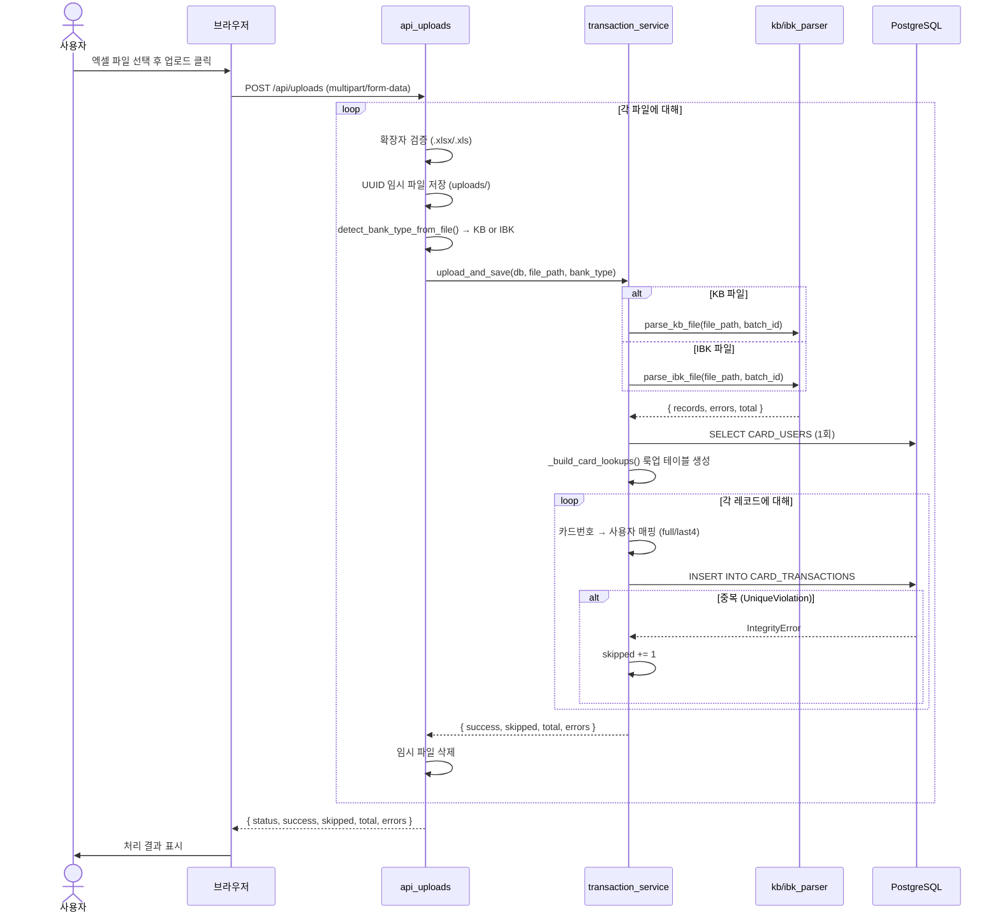
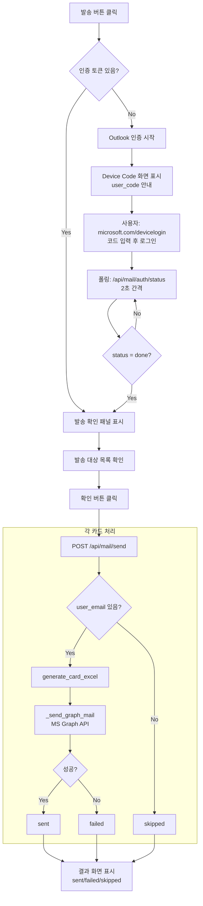

# 01. 프로세스 흐름 (Process Flow)

## 1. 문서 목적
사용자가 Card Auto를 실제로 사용하는 **대표 업무 흐름**을 처음부터 끝까지 설명합니다.  
각 단계에서 어떤 화면이 열리고, 어떤 API가 호출되며, 백엔드에서 무슨 처리가 일어나는지를 순서대로 기술합니다.

---

## 2. 핵심 요약

Card Auto의 업무 흐름은 크게 5가지입니다:

| # | 흐름 | 설명 |
|---|------|------|
| A | 파일 업로드 및 파싱 | 엑셀 업로드 → 은행 판별 → 파싱 → 사용자 매핑 → DB 저장 |
| B | 거래내역 조회 및 재매핑 | DB 데이터 필터 조회, 미매핑 건 재처리 |
| C | 엑셀 결과 파일 생성 및 다운로드 | 카드별 엑셀 파일 생성, ZIP 일괄 다운로드 |
| D | Outlook 메일 자동 발송 | 인증 후 카드 사용자에게 개인별 파일 이메일 발송 |
| E | 마스터 데이터 관리 | 카드 사용자, 프로젝트, 솔루션, 계정과목 CRUD |

---

## 3. 흐름 A: 파일 업로드 및 파싱

### 단계 설명

```
[사용자] 엑셀 파일 선택 (KB/IBK 동시 선택 가능)
    ↓
[화면] upload.html - 드래그앤드롭 또는 클릭 업로드
    ↓
[JS] fetch('POST /api/uploads', FormData)
    ↓
[Router] api_uploads.py: upload_files()
    │
    ├─ 파일 확장자 검증 (.xlsx/.xls만 허용)
    ├─ 임시 파일로 저장 (uploads/{uuid}.xlsx)
    ├─ detect_bank_type_from_file() → KB 또는 IBK 자동 판별
    ├─ upload_and_save(db, file_path, bank_type) 호출
    │    ↓
    │   [Service] transaction_service.py: upload_and_save()
    │    ├─ KB → parse_kb_file() 호출
    │    │   └─ kb_parser.py: 헤더 탐지, 컬럼 매핑, 레코드 생성
    │    ├─ IBK → parse_ibk_file() 호출
    │    │   └─ ibk_parser.py: 헤더 탐지, 날짜/시간 분리, 레코드 생성
    │    ├─ _build_card_lookups() → CARD_USERS 1회 조회 (N+1 방지)
    │    └─ 각 레코드 처리:
    │         ├─ 전체 카드번호로 full_lookup 매칭 시도
    │         ├─ 실패 시 card_last4로 last4_lookup 매칭
    │         ├─ 매핑 성공: card_owner_name 설정, mapping_status='mapped'
    │         ├─ 매핑 실패: mapping_status='unmapped'
    │         └─ Transaction 모델로 DB INSERT (중복 시 스킵)
    └─ 임시 파일 삭제 (finally)
    ↓
[응답] { success, skipped, total, errors, files }
    ↓
[화면] 처리 결과 패널 표시 (저장 성공/중복 스킵/오류 건수)
```

### 예외 처리
- 엑셀 파일이 아닌 경우: 즉시 에러 반환
- 중복 거래 (UniqueViolation): skipped 카운터 증가, 계속 진행
- 기타 DB 오류: savepoint rollback, errors 목록에 추가
- 알 수 없는 은행 타입: 에러 반환

---

## 4. 흐름 B: 거래내역 조회 및 재매핑

### 단계 설명

```
[사용자] /transactions 페이지 접속 (또는 필터 조건 입력 후 검색)
    ↓
[Router] pages.py: transactions_page()
    │  → get_transactions(db, bank, user_name, ...) 호출
    │  → Jinja2 템플릿으로 서버사이드 렌더링
    ↓
[화면] 거래내역 테이블 표시 (은행, 승인일, 카드번호, 사용자, 가맹점명, 금액)
    │  - 매핑됨: 사용자명 표시
    │  - 미매핑: "미매핑(끝4자리)" 빨간색 표시

[선택 A] 재매핑 버튼 클릭
    ↓
[JS] fetch('POST /api/transactions/remap')
    ↓
[Service] remap_transactions()
    ├─ mapping_status='unmapped' 거래 전체 조회
    ├─ _build_card_lookups() 재실행
    └─ 매칭된 건 card_owner_name, mapping_status 업데이트

[선택 B] 전체 삭제 버튼 클릭 (confirm 확인 후)
    ↓
[JS] fetch('DELETE /api/transactions')
    ↓
[Service] delete_all_transactions() → CARD_TRANSACTIONS 전체 삭제
```

---

## 5. 흐름 C: 엑셀 결과 파일 생성

### 단계 설명

```
[사용자] /exports 페이지 접속
    ↓
[Router] pages.py: exports_page()
    │  → get_cards_for_export(db, year_month) 호출
    │  → 거래내역 기준으로 카드별 목록 집계
    ↓
[화면] 카드별 목록 표시 (은행, 카드번호, 사용자명, 건수, 이메일)

[선택 A] 개별 엑셀 다운로드
    ↓
[JS] fetch('POST /api/exports/generate', { card_number, bank, year_month, user_name })
    ↓
[Service] excel_export_service.generate_card_excel()
    ├─ 해당 카드의 거래내역 조회
    ├─ 활성 프로젝트/솔루션/계정과목 목록 조회
    ├─ openpyxl로 워크북 생성
    │   ├─ 숨김 시트 'meta' 생성 (드롭다운 옵션 저장)
    │   ├─ '내역' 시트에 헤더 + 데이터 작성 (노란색 배경)
    │   ├─ 드롭다운 유효성 검사 추가 (프로젝트/솔루션/계정과목/Flex)
    │   └─ 컬럼 너비, 틀 고정 설정
    └─ exports/{사용자명} {YYYYMM}({은행}).xlsx 저장
    ↓
[JS] fetch('GET /api/exports/download/{file_name}') → 파일 다운로드

[선택 B] 전체 ZIP 다운로드
    ↓
[JS] fetch('POST /api/exports/download-all-zip', { cards: [...] })
    ↓
[Router] 각 카드에 대해 generate_card_excel() 반복 호출
    └─ zipfile.ZipFile로 ZIP 압축 → StreamingResponse 반환
```

---

## 6. 흐름 D: Outlook 메일 자동 발송

### 단계 설명

```
[사용자] exports.html에서 "전체 메일 발송" 또는 개별 "발송" 버튼 클릭
    ↓
[JS] fetch('GET /api/mail/auth/status')
    ├─ has_token=true → 발송 확인 패널 표시
    └─ has_token=false → Outlook 인증 패널 표시

[인증이 필요한 경우]
    ↓
[JS] fetch('POST /api/mail/auth/start')
    ↓
[Service] mail_service.start_device_code_auth()
    ├─ MSAL Device Code Flow 시작 (백그라운드 스레드)
    ├─ user_code, verification_url 반환
    └─ 사용자: https://microsoft.com/devicelogin 접속 → 코드 입력 → 로그인
    ↓
[JS] setInterval → 'GET /api/mail/auth/status' 폴링 (2초 간격)
    └─ status='done' 확인 시 발송 패널으로 전환
    ↓
[토큰 캐시] data/card_auto_mail_token.json에 자동 저장

[메일 발송]
    ↓
[JS] fetch('POST /api/mail/send', { cards: [...] })
    ↓
[Service] mail_service.send_card_mails()
    └─ 각 카드에 대해:
        ├─ user_email 없으면 skipped
        ├─ generate_card_excel() 호출 → 엑셀 파일 생성
        ├─ _build_mail_body() → HTML 메일 본문 생성
        └─ _send_graph_mail() → Microsoft Graph API POST
            └─ 첨부파일 base64 인코딩 후 발송
    ↓
[응답] { sent, failed, skipped, details }
[화면] 발송 결과 표시
```

---

## 7. 흐름 E: 마스터 데이터 관리

### 카드 사용자 등록 흐름

```
[화면] /lookups/cards → 등록 모달 → 폼 입력
    ↓
[JS] fetch('POST /api/lookups/cards', { bank_type, card_last4, card_number_full, user_name, user_email })
    ↓
[Router] api_lookups.py: create_card_user()
    ├─ 중복 카드번호 검증 (GET → 409 반환)
    └─ lookup_service → card_user_service → CardRepository.create()
        └─ CARD_USERS 테이블에 INSERT
            (card_no, user_name, card_type, card_no_normalized, card_last4, user_email)
```

### 프로젝트/솔루션/계정과목 관리 흐름

```
[화면] /lookups/projects (또는 solutions, accounts)
    ├─ 추가: POST /api/lookups/projects
    ├─ 수정: PUT /api/lookups/projects/{name}
    ├─ 삭제: DELETE /api/lookups/projects/{name}
    └─ 순서 변경: POST /api/lookups/projects/reorder (drag & drop)
```

---

## 8. mermaid sequence diagram: 파일 업로드 흐름



---

## 9. mermaid flowchart: 메일 발송 흐름



---

## 10. 질문받기 쉬운 포인트

### Q: 어디서 은행을 판별하나요?
→ `app/parsers/common.py`의 `detect_bank_type_from_file()` 함수.  
엑셀 파일 상단 10행을 읽어 "승인일시"+"이용가맹점명" → IBK, "승인일"+"가맹점명" → KB로 구분.

### Q: 어디서 사용자를 매핑하나요?
→ `app/services/transaction_service.py`의 `upload_and_save()` 함수 내.  
카드 마스터(CARD_USERS)를 1회 조회 후 메모리 딕셔너리(`full_lookup`, `last4_lookup`)로 빠르게 매칭.

### Q: 중복 파일 업로드 시 어떻게 되나요?
→ DB에 Unique 제약(`source_bank + approval_datetime + card_number_raw + merchant_name + approval_amount`)이 있어 중복은 자동 skip. 성공/스킵 건수를 각각 화면에 표시.

### Q: 메일이 실패하면 어떻게 되나요?
→ 해당 건만 `status='failed'`로 표기하고 나머지는 계속 발송. 발송 결과 화면에서 성공/실패/스킵 상세 내역 확인 가능.

### Q: 재매핑은 언제 사용하나요?
→ 파일 업로드 후 카드 사용자 마스터를 뒤늦게 등록했을 경우. "사용자 재매핑" 버튼 클릭 시 미매핑 거래 전체를 재처리.

### Q: 생성된 엑셀 파일은 어디에 있나요?
→ 서버의 `exports/` 폴더. 파일명 형식: `{사용자명} {YYYYMM}({은행코드}).xlsx`

---

## 11. 코드리뷰/운영 관점 메모

- 업로드된 임시 파일은 `finally` 블록에서 반드시 삭제됨 → 파일 잔재 없음
- savepoint 패턴 사용 → 한 건 실패 시 전체 롤백 방지, 다음 건 계속 처리
- 메일 발송은 순차 처리 (병렬 없음) → 대용량 시 시간 소요 가능
- 메일 토큰은 파일 캐시 (`data/card_auto_mail_token.json`) → 서버 재시작 후에도 유지
