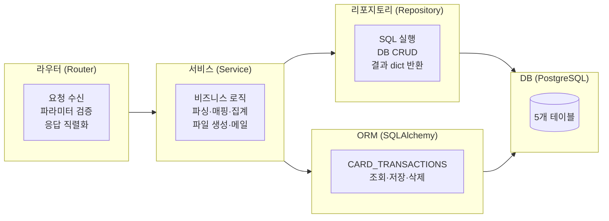

# 02. 백엔드 전체 구조 (Backend Overview)

## 1. 문서 목적
백엔드 전체 구조, 기술 스택, 레이어 구분, 요청 처리 흐름을 설명합니다.

---

## 2. 핵심 요약

| 항목 | 내용 |
|------|------|
| **프레임워크** | FastAPI 0.100+ |
| **언어** | Python 3.11+ |
| **DB** | PostgreSQL (SQLAlchemy ORM + psycopg2 Raw SQL 이원화) |
| **외부 API** | Microsoft Graph API (메일 발송) |
| **파일 처리** | pandas (엑셀 파싱), openpyxl (엑셀 생성) |
| **인증** | MSAL (Device Code Flow) |
| **서버 실행** | uvicorn |

---

## 3. 기술 스택 상세

```
FastAPI          - 비동기 웹 프레임워크. Router/Dependency Injection 활용
SQLAlchemy 2.0   - ORM (CARD_TRANSACTIONS 테이블만 사용)
psycopg2         - Raw SQL 직접 실행 (CARD_USERS, 마스터 테이블)
Jinja2           - 서버사이드 HTML 템플릿 렌더링
pandas           - 엑셀 파일 읽기 (pd.read_excel)
openpyxl         - 엑셀 파일 생성 (서식, 드롭다운 포함)
MSAL             - Microsoft 인증 라이브러리 (Device Code Flow)
python-dotenv    - .env 환경변수 로드
```

---

## 4. 백엔드 디렉토리 구조

```
app/
├── main.py                     # 진입점: FastAPI 앱, 라우터 등록
│
├── core/
│   ├── config.py               # 환경변수, 디렉토리 경로 (전역 설정)
│   └── database.py             # SQLAlchemy 엔진, SessionLocal, get_db()
│
├── models/
│   └── transaction.py          # CARD_TRANSACTIONS ORM 모델 (Transaction 클래스)
│
├── routers/                    # HTTP 요청 진입점
│   ├── pages.py                # GET  /   /upload /transactions /exports /lookups/*
│   ├── api_uploads.py          # POST /api/uploads
│   ├── api_transactions.py     # GET/POST/DELETE /api/transactions/*
│   ├── api_lookups.py          # CRUD /api/lookups/cards|projects|solutions|accounts
│   ├── api_exports.py          # POST/GET /api/exports/*
│   └── api_mail.py             # GET/POST /api/mail/*
│
├── services/                   # 비즈니스 로직
│   ├── transaction_service.py  # 파싱·매핑·저장·조회 핵심 서비스
│   ├── card_user_service.py    # CARD_USERS CRUD (psycopg2)
│   ├── lookup_service.py       # 마스터 CRUD Facade (Router → Service 연결)
│   ├── excel_export_service.py # openpyxl 기반 엑셀 파일 생성
│   └── mail_service.py         # MSAL + Graph API 메일 발송
│
├── parsers/                    # 엑셀 파일 파싱
│   ├── common.py               # 공통 유틸 (날짜 정규화, 카드번호 추출 등)
│   ├── kb_parser.py            # KB국민카드 파서
│   └── ibk_parser.py           # IBK기업은행 파서
│
└── db/                         # 데이터 접근 레이어 (psycopg2 기반)
    ├── connection.py           # get_pg_conn() 컨텍스트 매니저
    ├── base.py                 # PgRepository (fetch_all/fetch_one/execute)
    ├── bootstrap.py            # 테이블 생성 DDL, 시드 데이터
    └── repositories/
        ├── card_repository.py  # CARD_USERS CRUD
        ├── lookup_repository.py # PROJECTS/SOLUTIONS/EXPENSE_CATEGORIES CRUD
        └── master_repository.py # (레거시 - lookup_repository와 구조 동일)
```

---

## 5. 레이어 구분 및 책임



| 레이어 | 위치 | 책임 | 사용 기술 |
|--------|------|------|-----------|
| **Router** | `app/routers/` | HTTP 수신, 입력 검증, 응답 포맷팅 | FastAPI, Pydantic |
| **Service** | `app/services/` | 핵심 비즈니스 로직, 외부 API 연동 | Python |
| **Parser** | `app/parsers/` | 엑셀 파일 파싱, 데이터 정규화 | pandas |
| **Repository** | `app/db/repositories/` | Raw SQL 실행 (마스터 테이블) | psycopg2 |
| **ORM Model** | `app/models/` | 거래내역 DB 접근 | SQLAlchemy |

---

## 6. 요청 처리 흐름

### 일반 API 요청 흐름

```
HTTP 요청
    ↓
FastAPI 라우터 (router/*.py)
    ├─ Pydantic 모델로 요청 바디 자동 검증
    ├─ get_db() → SQLAlchemy 세션 DI
    └─ 서비스 함수 호출
        ↓
서비스 (services/*.py)
    ├─ 비즈니스 로직 처리
    ├─ 리포지토리 또는 ORM 모델 호출
    └─ 결과 반환
        ↓
리포지토리 (db/repositories/*.py)
    ├─ get_pg_conn() → psycopg2 커넥션 획득
    ├─ SQL 실행
    └─ dict 형태로 결과 반환
        ↓
HTTP 응답 (JSON)
```

### HTML 페이지 요청 흐름

```
GET /transactions?bank=KB&page=1
    ↓
pages.py: transactions_page()
    ├─ get_db() → SQLAlchemy 세션
    ├─ get_transactions(db, ...) → 데이터 조회
    └─ templates.TemplateResponse("transactions.html", context)
        ↓
Jinja2 템플릿 렌더링 → HTML 응답
```

---

## 7. 데이터 접근 방식 (이중 구조)

이 프로젝트는 두 가지 DB 접근 방식을 **목적에 따라 구분**해서 사용합니다:

| 방식 | 대상 테이블 | 이유 |
|------|-------------|------|
| **SQLAlchemy ORM** | CARD_TRANSACTIONS | 복잡한 동적 필터링, 페이지네이션, savepoint 트랜잭션 |
| **psycopg2 Raw SQL** | CARD_USERS, PROJECTS, SOLUTIONS, EXPENSE_CATEGORIES | 단순 CRUD, 명시적 SQL, 테스트 용이성 |

```python
# ORM 방식 (transaction_service.py)
q = db.query(Transaction).filter(Transaction.source_bank == "KB")
items = q.order_by(Transaction.approval_datetime.desc()).all()

# Raw SQL 방식 (card_repository.py)
self.fetch_all('SELECT card_no, user_name FROM "CARD_USERS"')
```

---

## 8. 예외 처리 방식

| 상황 | 처리 방식 |
|------|-----------|
| 업로드 중복 거래 | `IntegrityError` catch → savepoint rollback → skipped 카운터 |
| 필수 파라미터 누락 | FastAPI/Pydantic 자동 422 반환 |
| DB 레코드 없음 | 서비스에서 `None` 반환 → 라우터에서 HTTP 404 반환 |
| 메일 발송 실패 | 해당 건 `status='failed'` 기록, 전체 발송은 계속 진행 |
| 인증 실패 (메일) | `PermissionError` → HTTP 401 반환 |
| 엑셀 생성 실패 | `Exception` → HTTP 500 반환 |
| 마스터 데이터 없음 | `HTTPException(404)` |
| 마스터 데이터 중복 | 사전 조회 후 `HTTPException(409)` |

```python
# savepoint 패턴 (transaction_service.py)
savepoint = db.begin_nested()
try:
    db.add(tx)
    db.flush()
    savepoint.commit()
    saved += 1
except IntegrityError:
    savepoint.rollback()
    skipped += 1  # 중복은 skip
except Exception as e:
    savepoint.rollback()
    errors.append(...)  # 그 외 오류는 기록
db.commit()  # 마지막에 전체 커밋
```

---

## 9. 설정/환경변수 구조

모든 설정은 `app/core/config.py`에서 관리합니다.

```python
# .env 파일 로드
PG_HOST     = os.getenv("PG_HOST", "localhost")
PG_PORT     = os.getenv("PG_PORT", "5432")
PG_DATABASE = os.getenv("PG_DATABASE", "postgres")
PG_USER     = os.getenv("PG_USER", "postgres")
PG_PASSWORD = os.getenv("PG_PASSWORD", "postgres")

EMAIL_SENDER     = os.getenv("EMAIL_SENDER", "")      # Outlook 발신자
AZURE_CLIENT_ID  = os.getenv("AZURE_CLIENT_ID", "")   # Azure 앱 ID
AZURE_TENANT_ID  = os.getenv("AZURE_TENANT_ID", "")   # Azure 테넌트 ID

UPLOAD_DIR = BASE_DIR / "uploads"   # 임시 파일
EXPORT_DIR = BASE_DIR / "exports"   # 결과 엑셀
DATA_DIR   = BASE_DIR / "data"      # 토큰 캐시
TOKEN_CACHE_PATH = DATA_DIR / "card_auto_mail_token.json"
```

> **주의:** `.env` 파일은 Git에 포함되지 않습니다. 배포 시 별도 설정 필요.

---

## 10. 백엔드에서 가장 중요한 5개 포인트

### 포인트 1: N+1 방지 - `_build_card_lookups()`
`app/services/transaction_service.py`

업로드 시 수백~수천 건의 거래를 처리할 때, 매 건마다 DB 조회를 하지 않고 **카드 마스터를 1회 조회 후 메모리 딕셔너리**로 매핑.

```python
def _build_card_lookups(db: Session) -> tuple[dict, dict]:
    users = get_all_card_users(db)      # DB 1회 조회
    full_lookup = {}                    # (card_no_normalized, bank) → user
    last4_lookup = {}                   # (card_last4, bank) → user
    ...
    return full_lookup, last4_lookup
```

### 포인트 2: savepoint 트랜잭션 패턴
`app/services/transaction_service.py: upload_and_save()`

한 건의 중복/오류가 전체 업로드를 실패시키지 않도록 savepoint 사용.

### 포인트 3: 자동 은행 판별
`app/parsers/common.py: detect_bank_type_from_file()`

파일 헤더 키워드 분석으로 KB/IBK 자동 구분. 사용자가 은행을 직접 선택할 필요 없음.

### 포인트 4: 이중 DB 접근 구조
- CARD_TRANSACTIONS: SQLAlchemy ORM (복잡한 동적 쿼리 대응)
- 마스터 테이블: psycopg2 Raw SQL (단순 CRUD, 명시적 제어)

### 포인트 5: Device Code Flow 비동기 인증
`app/services/mail_service.py`

MSAL Device Code Flow를 별도 스레드에서 실행하고, 프론트엔드는 `/api/mail/auth/status` 폴링으로 완료 감지. 토큰은 파일 캐시로 자동 갱신.

---

## 11. 질문받기 쉬운 포인트

- **Q: FastAPI를 선택한 이유는?**  
  → Python 기반, 타입 힌트 지원, Pydantic 자동 검증, 비동기 처리 가능, OpenAPI 문서 자동 생성

- **Q: 왜 ORM과 Raw SQL을 혼용하나요?**  
  → 거래내역은 동적 필터링/페이지네이션이 복잡해 ORM이 적합. 마스터 테이블은 단순 CRUD로 Raw SQL이 더 직관적이고 제어가 쉬움.

- **Q: 동시 요청 처리는 어떻게 되나요?**  
  → uvicorn 기본 설정. 메일 인증 상태는 모듈 수준 전역 변수 + 스레드 Lock으로 관리.

---

## 12. 확인 필요 사항

- `app/db/repositories/master_repository.py`와 `lookup_repository.py`가 구조가 거의 동일함 → 레거시 중복 존재 여부 확인 필요
- `app/database/` 폴더가 별도 존재하나 실제 파일 없음 → 레거시 폴더로 추정
