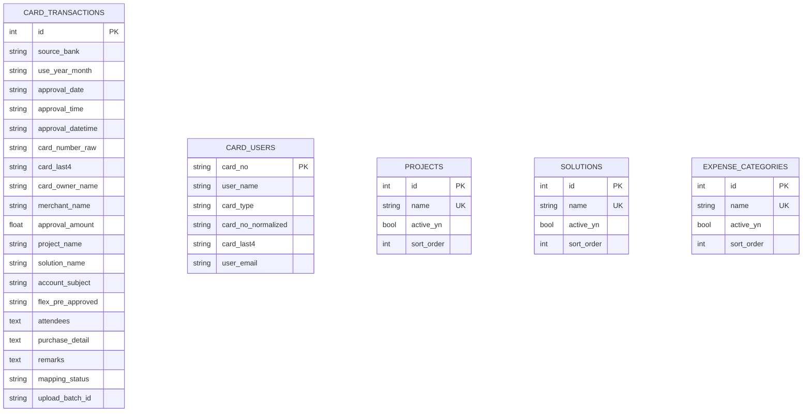

# 07. 데이터 모델 및 저장 구조 (Data Model & Storage)

## 1. 문서 목적
PostgreSQL 테이블 구조, 각 엔티티의 역할, 저장/조회/수정 흐름, 파일 기반 저장 구조를 설명합니다.

---

## 2. 핵심 요약

| 저장소 | 대상 | 관리 방식 |
|--------|------|-----------|
| **PostgreSQL** | 거래내역, 카드사용자, 마스터 데이터 | SQLAlchemy ORM + psycopg2 Raw SQL |
| **파일 시스템 (uploads/)** | 업로드 임시 파일 | 처리 후 자동 삭제 |
| **파일 시스템 (exports/)** | 생성된 결과 엑셀 | 영구 저장 (자동 삭제 없음) |
| **파일 시스템 (data/)** | MS Graph 토큰 캐시 JSON | 자동 갱신 저장 |

---

## 3. PostgreSQL 테이블 목록

| 테이블 | 한국어 명칭 | 역할 | 레코드 수 예상 |
|--------|------------|------|---------------|
| `CARD_TRANSACTIONS` | 거래내역 | 법인카드 승인 내역 저장 | 월별 수백~수천 건 |
| `CARD_USERS` | 카드 사용자 | 카드번호 ↔ 사용자 매핑 마스터 | 수십 명 |
| `PROJECTS` | 프로젝트 | 결과 엑셀 드롭다운 목록 | 수십 개 |
| `SOLUTIONS` | 솔루션 | 결과 엑셀 드롭다운 목록 | 수십 개 |
| `EXPENSE_CATEGORIES` | 계정과목 | 결과 엑셀 드롭다운 목록 | 수십 개 |

---

## 4. 테이블 상세 스키마

### CARD_TRANSACTIONS (거래내역)
**출처:** `scripts/sql/init_schema.sql`, `app/models/transaction.py`

```sql
CREATE TABLE "CARD_TRANSACTIONS" (
    id                  SERIAL PRIMARY KEY,
    source_bank         VARCHAR(10) NOT NULL,      -- 'KB' 또는 'IBK'
    use_year_month      VARCHAR(6),                -- YYYYMM (예: '202601')
    approval_date       VARCHAR(10),               -- YYYY-MM-DD
    approval_time       VARCHAR(8),                -- HH:MM:SS
    approval_datetime   VARCHAR(20),               -- 정렬용 결합 문자열
    card_number_raw     VARCHAR(50),               -- 원본 카드번호 (마스킹 포함 가능)
    card_last4          VARCHAR(4),                -- 끝 4자리
    card_owner_name     VARCHAR(50),               -- 매핑된 사용자명
    merchant_name       VARCHAR(200),              -- 가맹점명
    approval_amount     REAL,                      -- 승인금액
    -- 결과 파일용 (담당자 입력 필드)
    project_name        VARCHAR(200),              -- 프로젝트명 (엑셀에서 입력)
    solution_name       VARCHAR(200),              -- 솔루션명
    account_subject     VARCHAR(200),              -- 계정과목
    flex_pre_approved   VARCHAR(1),                -- Flex 사전승인 (O/X)
    attendees           TEXT,                      -- 참석자
    purchase_detail     TEXT,                      -- 구매내역
    remarks             TEXT,                      -- 기타사항
    -- 운영용
    mapping_status      VARCHAR(20) DEFAULT 'unmapped',  -- 'mapped' 또는 'unmapped'
    upload_batch_id     VARCHAR(50),               -- 업로드 배치 UUID
    CONSTRAINT uq_card_transaction UNIQUE (
        source_bank, approval_datetime, card_number_raw, merchant_name, approval_amount
    )
);
-- 인덱스
CREATE INDEX ON "CARD_TRANSACTIONS"(card_last4);
CREATE INDEX ON "CARD_TRANSACTIONS"(upload_batch_id);
CREATE INDEX ON "CARD_TRANSACTIONS"(use_year_month);
```

**주요 설계 포인트:**
- `approval_datetime` 컬럼이 정렬용으로 별도 존재 (날짜+시간 결합 문자열)
- 중복 방지 유니크 제약: `(source_bank, approval_datetime, card_number_raw, merchant_name, approval_amount)`
- `project_name`, `solution_name` 등은 현재 코드상 DB에 저장은 되지만, 결과 엑셀 생성 시에는 읽지 않음 (엑셀은 빈 값으로 생성 후 담당자가 직접 입력)

---

### CARD_USERS (카드 사용자)
**출처:** `app/db/bootstrap.py`, `scripts/sql/init_schema.sql`

```sql
CREATE TABLE "CARD_USERS" (
    card_no             VARCHAR(30) NOT NULL,       -- 카드번호 (PK, 원본)
    user_name           VARCHAR(50) NOT NULL,       -- 사용자명
    card_type           VARCHAR(20) NOT NULL,       -- 'KB' 또는 'IBK'
    card_no_normalized  VARCHAR(30),                -- 숫자만 추출한 카드번호 (비교용)
    card_last4          CHAR(4),                    -- 끝 4자리
    user_email          VARCHAR(100),               -- 이메일 (메일 발송용)
    CONSTRAINT pk_card_users PRIMARY KEY (card_no)
);
-- 인덱스
CREATE INDEX ON "CARD_USERS"(card_no_normalized);
CREATE INDEX ON "CARD_USERS"(card_last4);
```

**주요 설계 포인트:**
- `card_no` (PK): 원본 카드번호 그대로 저장 (하이픈 포함 가능)
- `card_no_normalized`: 숫자만 추출 → 비교 시 포맷 차이 흡수
- `card_last4`: 마스킹된 카드번호(9234-****-****-1234)에서도 매핑 가능하도록
- `card_type`: 은행 구분 (같은 끝4자리가 KB/IBK 양쪽에 있을 수 있음)

---

### PROJECTS (프로젝트)
```sql
CREATE TABLE "PROJECTS" (
    id          SERIAL PRIMARY KEY,
    name        VARCHAR(200) NOT NULL UNIQUE,  -- 프로젝트명 (유일)
    active_yn   BOOLEAN NOT NULL DEFAULT TRUE, -- 활성 여부
    sort_order  INTEGER NOT NULL DEFAULT 0,    -- 표시 순서
    created_at  TIMESTAMP DEFAULT CURRENT_TIMESTAMP
);
```

---

### SOLUTIONS (솔루션)
```sql
CREATE TABLE "SOLUTIONS" (
    id          SERIAL PRIMARY KEY,
    name        VARCHAR(200) NOT NULL UNIQUE,
    active_yn   BOOLEAN NOT NULL DEFAULT TRUE,
    sort_order  INTEGER NOT NULL DEFAULT 0,
    created_at  TIMESTAMP DEFAULT CURRENT_TIMESTAMP
);
```

기본 시드 데이터: 'DataRobot', 'Github', 'Presales - 솔루션', '해당사항 없음'

---

### EXPENSE_CATEGORIES (계정과목)
```sql
CREATE TABLE "EXPENSE_CATEGORIES" (
    id          SERIAL PRIMARY KEY,
    name        VARCHAR(200) NOT NULL UNIQUE,
    active_yn   BOOLEAN NOT NULL DEFAULT TRUE,
    sort_order  INTEGER NOT NULL DEFAULT 0,
    created_at  TIMESTAMP DEFAULT CURRENT_TIMESTAMP
);
```

기본 시드 데이터: '식대', '교통비', '접대비', '회의비', '소모품비', '도서인쇄비', '교육훈련비', '기타경비'

---

## 5. ER 다이어그램



> **주의:** 테이블 간 외래키(FK) 관계는 없습니다. CARD_TRANSACTIONS의 `card_owner_name`은 CARD_USERS를 참조하지 않고 단순 문자열 저장. 정규화보다 단순성을 선택한 설계입니다.

---

## 6. 저장/조회/수정 흐름

### CARD_TRANSACTIONS

| 작업 | 호출 경로 | 방식 |
|------|-----------|------|
| 저장 | `upload_and_save()` → `Transaction INSERT` | SQLAlchemy ORM |
| 조회 | `get_transactions()` | SQLAlchemy 동적 쿼리 |
| 매핑 업데이트 | `remap_transactions()` | SQLAlchemy UPDATE |
| 전체 삭제 | `delete_all_transactions()` | SQLAlchemy DELETE |

**특이사항:** ORM을 사용하지만 `db.begin_nested()` (savepoint)로 개별 레코드 단위 트랜잭션 제어.

### CARD_USERS

| 작업 | 호출 경로 | 방식 |
|------|-----------|------|
| 전체 조회 | `CardRepository.get_all()` | Raw SQL SELECT |
| 카드번호 조회 | `find_by_card_number()` | Raw SQL WHERE normalized |
| 끝4자리 조회 | `find_by_last4()` | Raw SQL WHERE last4 |
| 등록 | `CardRepository.create()` | Raw SQL INSERT RETURNING |
| 수정 | `CardRepository.update()` | Raw SQL UPDATE RETURNING |
| 삭제 | `CardRepository.delete()` | Raw SQL DELETE |

### PROJECTS / SOLUTIONS / EXPENSE_CATEGORIES

| 작업 | 방식 |
|------|------|
| 전체 조회 | `BaseLookupRepository.get_all()` → `SELECT ORDER BY sort_order, name` |
| 활성 항목만 | `get_all(active_only=True)` → `WHERE active_yn = TRUE` |
| 등록 | `INSERT RETURNING` (SERIAL PK 자동 채번) |
| 수정 | `UPDATE WHERE key = %s RETURNING` |
| 삭제 | `DELETE WHERE key = %s` |
| 순서 변경 | `reorder_keys()` → 단일 트랜잭션에서 sort_order 100, 200, 300... 일괄 업데이트 |

---

## 7. 파일 기반 저장 구조

### uploads/ (임시 파일)
```
uploads/
└── {uuid}.xlsx  ← 업로드 처리 중 임시 파일
```
- 업로드 시 UUID 파일명으로 저장
- 파싱 완료 후 `finally` 블록에서 `unlink()` 삭제
- 처리 도중 오류 발생 시에도 삭제 보장

### exports/ (결과 엑셀)
```
exports/
└── {사용자명} {YYYYMM}({은행코드}).xlsx
    예: 홍길동 202601(KB).xlsx
        김철수 202601(IBK).xlsx
```
- 생성할 때 마다 덮어씌워짐 (버전 관리 없음)
- 자동 삭제 정책 없음 → 수동 관리 필요

### data/ (토큰 캐시)
```
data/
└── card_auto_mail_token.json  ← MS Graph API 토큰 캐시
```
- MSAL `SerializableTokenCache`가 자동 관리
- 인증 성공 시 자동 저장, 갱신 시 자동 업데이트
- `.gitignore`에 포함 필요 (실제 포함 여부는 확인 필요)

---

## 8. 주요 도메인 데이터 설명

### 법인카드 거래 (핵심 도메인)
- **입력:** 은행 엑셀 파일 업로드
- **처리:** 파싱 → 사용자 매핑 → DB 저장
- **출력:** 결과 엑셀 파일 (담당자 입력 컬럼 포함)

### 카드 사용자 매핑 원리
```
거래내역의 card_number_raw → normalize → CARD_USERS.card_no_normalized 대조
                           → 매칭 실패 시 card_last4 대조 (폴백)
                           → 은행(card_type) 함께 비교 (같은 끝4자리 충돌 방지)
```

### 마스터 데이터 (룩업 테이블)
- 프로젝트/솔루션/계정과목: 결과 엑셀의 드롭다운 소스
- `active_yn=True`인 항목만 엑셀 드롭다운에 포함
- `sort_order`로 표시 순서 관리 (100 단위 증가)

---

## 9. 질문받기 쉬운 포인트

- **Q: DB 백업은 어떻게 하나요?**  
  → `scripts/db_cleanup/backup_db_to_csv.py` 스크립트로 CSV 백업 가능. `backups/` 폴더에 저장.

- **Q: 거래내역을 다시 올리면 중복 처리가 되나요?**  
  → 유니크 제약 (source_bank + approval_datetime + card_number_raw + merchant_name + amount)으로 중복 자동 차단. 스킵 건수로 표시.

- **Q: 테이블 간 관계는 어떻게 되나요?**  
  → 외래키 제약 없음. `card_owner_name`은 문자열 복사 방식. 마스터 변경이 거래내역에 영향 없는 단순한 구조.

- **Q: 엑셀 파일이 쌓이면 어떻게 하나요?**  
  → 현재 자동 삭제 없음. 주기적으로 `exports/` 폴더 수동 정리 필요.

---

## 10. 확인 필요 사항

- `CARD_TRANSACTIONS`의 `project_name`, `solution_name`, `account_subject` 컬럼: 파서에서는 `null`로 설정하고, 엑셀 생성 시에도 DB에서 읽지 않음 → 컬럼이 실제로 활용되는지 확인 필요
- `exports/` 폴더 파일 관리 정책 미정의 → 장기 운영 시 디스크 공간 문제 가능
- 토큰 파일(`card_auto_mail_token.json`)이 `.gitignore`에 포함되어 있는지 확인 필요
